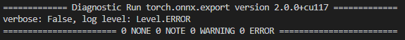
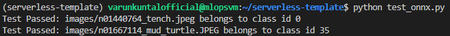

# 🍌 Banana Serverless
## MTailor MLOPs assessment

## Project Implementation

We start with installing pipenv to manage the pytorch environment on Ubuntu 20.04 LTS.

### Re-Creating a Virtual Environment with Python 3.9

1. Virtual Environment was created using pipenv:
```shell
sudo apt get update
sudo apt install python3-pip
pip install pipenv
```

Since pipenv was installed in .local path, additional steps were added to include it in PATH.
```shell
echo 'export PATH=$PATH:/path to userdir/.local/bin' >> ~/.bashrc
```
Activated environment with:
```shell
source ~/.bashrc
```

2. Create new virtual environment with Python 3.9 & activating it:
```shell
sudo apt install python3.9
pipenv --python 3.9
pipenv shell
```

3. Clone the repository and install dependencies using:
```shell
git clone https://github.com/varunkuntal/serverless-template.git
pipenv install --ignore-pipfile
```

## Convert PyTorch Model to ONNX

- In root folder of the directory, run 

```shell
python convert_to_onnx.py
```

We should get following output to confirm everything worked correctly:




## Test ONNX Model with Test Cases

- Run following script to test the converted ONNX model with sample files:

```shell
python test_onnx.py
```

If test worked correctly, we should get the following output:



