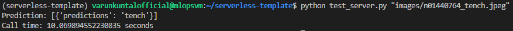
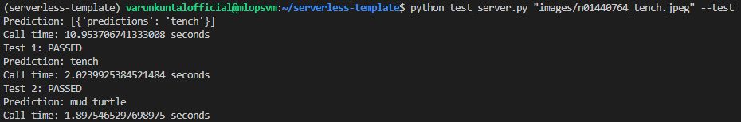
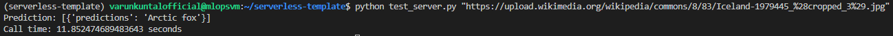
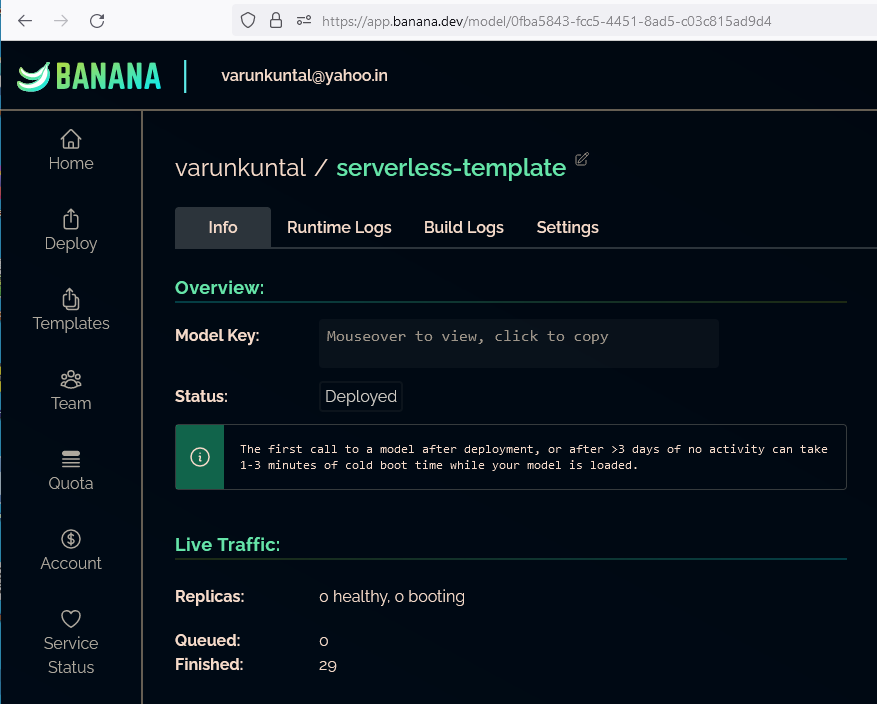
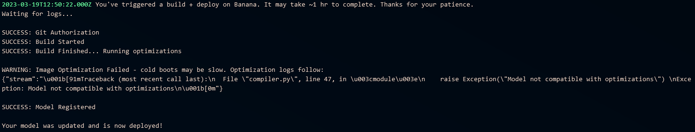

# 🍌 Banana Serverless
## MLOPs Practices

Table of Contents
=================

1.  [Introduction](#introduction)
2.  [Project Implementation](#project-implementation)
3.  [Re-Creating a Virtual Environment with Python 3.9](#re-creating-a-virtual-environment-with-python-39)
4.  [Convert PyTorch Model to ONNX](#convert-pytorch-model-to-onnx)
5.  [Test ONNX Model with Test Cases](#test-onnx-model-with-test-cases)
6.  [Test the deployed model on Banana dev using the API using `test_server.py`](#test-the-deployed-model-on-banana-dev-using-the-api-using-test_serverpy)
7.  [Deploying the app to **banana.dev**](#deploying-the-app-to-bananadev)


# Introduction 

This repo productionizes an Imagenet pytorch model, convert it to ONNX and deploys it to banana.dev.

## Model Details:

- Model is designed to perform classification on an input Image.
- PyTorch Implementation of model is present in pytorch_model.py, and weights were downloaded from the link: https://www.dropbox.com/s/b7641ryzmkceoc9/pytorch_model_weights.pth?dl=0
- The model is trained on ImageNet Dataset [https://www.image-net.org]
- The input to the model is an image of size 224x224, and the output is the array with probabilities for each class.
- The length of the output array is equal to the number of classes [1000] in the ImageNet dataset.

## Project Implementation

We start with installing pipenv to manage the pytorch environment on Ubuntu 20.04 LTS.

### Re-Creating a Virtual Environment with Python 3.9

1. Virtual Environment was created using pipenv:
```shell
sudo apt get update
sudo apt install python3-pip
pip install pipenv
```

Since pipenv was installed in .local path, additional steps were added to include it in PATH.
```shell
echo 'export PATH=$PATH:/path to userdir/.local/bin' >> ~/.bashrc
```
Activated environment with:
```shell
source ~/.bashrc
```

2. Create new virtual environment with Python 3.9 & activating it:
```shell
sudo apt install python3.9
pipenv --python 3.9
pipenv shell
```

3. Clone the repository and install dependencies using:
```shell
git clone https://github.com/varunkuntal/serverless-template.git
pipenv install --ignore-pipfile
```

## Convert PyTorch Model to ONNX

- In root folder of the directory, run 

```shell
python convert_to_onnx.py
```

We should get following output to confirm everything worked correctly:


## Test ONNX Model with Test Cases

- Run following script to test the converted ONNX model with sample files:

```shell
python test_onnx.py
```

If test worked correctly, we should get the following output:


The test file will report failure if the predicted & expected classess do not match.


## Test the deployed model on Banana dev using the API using `test_server.py`

To test the model, run the supplied `test_server.py` with arguments like:

```shell
python test_server.py "images/n01440764_tench.jpeg"
```
We get the following output:



We can also run tests along with the file with a `--tests` argument:

```shell
python test_server.py "images/n01440764_tench.jpeg" --test
```



The API is also compatiable with URL of images, for example we provide image of an Arctic Fox from Wikipedia:

```shell
python test_server.py "https://upload.wikimedia.org/wikipedia/commons/8/83/Iceland-1979445_%28cropped_3%29.jpg"
```

The classification is done correctly:




## Deploying the app to **banana.dev**

After adding all the modules as given in the instructions, adding the banana.dev authentication with Github repository, modifying the Dockerfile & committing changes to repo, our app is deployed everytime there is a push to the repo.

We can see status of running app:



We can see status of deployment in the BUILD LOGS section:


